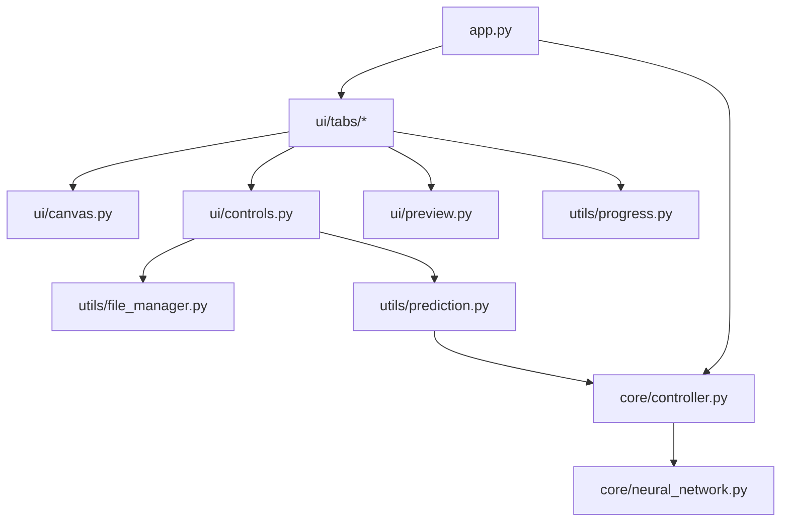

# Neural Network Drawing App - Modular Structure

## Overview
This document outlines the new modular structure for the application, splitting the current monolithic main.py into logical, cohesive modules.

## Directory Structure
```
src/
├── core/                     # Core application components
│   ├── __init__.py
│   ├── neural_network.py    # Neural network implementation
│   └── controller.py        # Neural network controller
├── ui/                      # UI components
│   ├── __init__.py
│   ├── canvas.py           # Canvas management
│   ├── preview.py          # Image preview
│   ├── controls.py         # Control panels
│   ├── tabs/              # Application tabs
│   │   ├── __init__.py
│   │   ├── drawing.py     # Drawing tab
│   │   └── training.py    # Neural network training tab
│   └── tooltip.py         # Tooltip helper
├── utils/                  # Utility modules
│   ├── __init__.py
│   ├── file_manager.py    # File operations
│   ├── prediction.py      # Prediction functionality
│   └── progress.py        # Progress tracking
└── app.py                 # Main application entry point
```

## Module Responsibilities

### Core Module
1. **neural_network.py**
   - `NeuralNetwork` class
   - Core neural network implementation
   - Training and prediction logic
   - Model saving/loading

2. **controller.py**
   - `NeuralNetController` class
   - Manages neural network lifecycle
   - Handles training/evaluation workflow
   - Interfaces between UI and neural network

### UI Module
1. **canvas.py**
   - `CanvasManager` class
   - Drawing canvas operations
   - Stroke management
   - Image processing

2. **preview.py**
   - `ImagePreviewFrame` class
   - Image preview display
   - Preview updates

3. **controls.py**
   - `ControlPanel` class
   - UI control widgets
   - Settings management
   - Action buttons

4. **tabs/**
   - Drawing and training tab implementations
   - Tab-specific UI logic
   - Event handling

5. **tooltip.py**
   - `ToolTip` class
   - Hover help text functionality

### Utils Module
1. **file_manager.py**
   - `FileManager` class
   - File saving/loading
   - Path management
   - Directory creation

2. **prediction.py**
   - `PredictionManager` class
   - Digit prediction workflow
   - Result display

3. **progress.py**
   - `ProgressManager` class
   - Progress bar updates
   - Status messages

### Main Application (app.py)
- `MergedApp` class
- Application initialization
- Tab management
- Global state

## Module Interactions



## Key Benefits
1. **Improved Maintainability**
   - Smaller, focused files
   - Clear separation of concerns
   - Easier to test and modify

2. **Better Organization**
   - Logical grouping of related functionality
   - Clear module boundaries
   - Reduced coupling

3. **Enhanced Extensibility**
   - Easy to add new features
   - Clear integration points
   - Modular testing

4. **Clear Dependencies**
   - Explicit import relationships
   - Reduced circular dependencies
   - Better code organization

## Implementation Notes
1. Each module should have clear entry points and interfaces
2. Minimize cross-module dependencies
3. Use relative imports within packages
4. Consider implementing factories for complex object creation
5. Add appropriate error handling at module boundaries